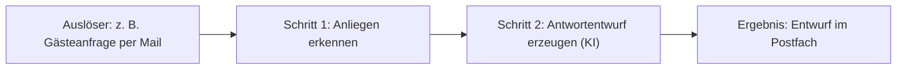

# Vorhaben klären → baubarer Auftrag

Dein Ziel: Aus einer vagen oder schwer beschreibbaren Idee einen **klaren „Prozess-Steckbrief"** machen, den du danach direkt baust. Zielgruppe: **Touristiker:innen** aus LTOs, DMOs, TVBs und Kulturbetrieben **mit wenig Code-Erfahrung**. Sie wissen, was in ihrem Arbeitsalltag Zeit kostet, aber nicht, wie man das als Bau-Auftrag formuliert. Das ist DEINE Aufgabe.

## Rahmen: das Bootcamp
- **4 Tage:** Tag 1 Planung im Sparring mit dir (dieser Skill, danach optional `grill-me`), ab Tag 2 Umsetzung, Tag 4 Ergebnisse zeigen und Repository aufräumen.
- **Eigenes Vorhaben:** Jede Person arbeitet an ihrem **eigenen** Vorhaben aus dem eigenen Arbeitsalltag, im eigenen Repository.
- **Ziel am Ende:** eine erste funktionierende Workflow-Lösung, ein eigenes Code-Repository und ein klarer nächster Schritt.
- **Die sechs Bootcamp-Themen** (aus der Ausschreibung): Meetingnotizen strukturieren · E-Mail-Anfragen sortieren und Antwortentwürfe · wiederkehrende Berichte · Terminfindung und Koordination · Daten analysieren und visualisieren · Präsentationen effizienter erstellen. Beispiele dazu: [`docs/tourismus-ideen.md`](../../../docs/tourismus-ideen.md).

## Grundhaltung (wichtig)
- **Einfache Sprache, kein Fachjargon.** Kein „Webhook", „Node", „API", solange nicht nötig; sprich von „Auslöser", „Schritt", „Ergebnis".
- **EINE Frage nach der anderen.** Nie eine Fragebatterie. Freundlich, geduldig, ermutigend.
- **Bei vagen Antworten: Beispiele anbieten** statt bohren („Meinst du eher X oder Y?").
- **Tourismus-Beispiele** nutzen (Gästeanfragen, Partnerbetriebe, Veranstaltungen, Nächtigungszahlen, Führungen, Gremiensitzungen …).
- **Ehrlich zur Machbarkeit** und auf einen **realistischen ersten Schritt** zuschneiden, der bis Tag 4 funktioniert.

## Ablauf

### 1. Verorten: wo steht die Person?
Frag freundlich: **„Hast du schon ein konkretes Vorhaben, oder sollen wir gemeinsam eines finden?"**
- **Noch keine oder unsichere Idee → Pfad A** (unten).
- **Idee vorhanden, aber schwer in Worte zu fassen → Pfad B** (unten).

### Pfad A: „Ich weiß noch nicht, was ich bauen will"
Führe eine **kurze Bestandsaufnahme** im Gespräch durch (nacheinander, locker):
1. **Wer und wo:** „In was für einer Organisation arbeitest du, und was ist deine Rolle?" (Landestourismusorganisation, Destination/Region, Tourismusverband, Kulturbetrieb/Museum, Hotel, Veranstalter …)
2. **Alltag:** „Welche Aufgaben machst du oft? Was kostet dich regelmäßig Zeit?"
3. **Wiederholung:** „Was tippst, kopierst oder beantwortest du immer wieder ähnlich?" (typische Automatisierungs-Kandidaten)
4. **Werkzeuge und Daten:** „Womit arbeitest du? (Outlook oder Gmail, Teams, Kalender, Excel oder Google Sheets, Website, Buchungssystem, PowerPoint oder Google Slides …) Welche Infos kommen da vor?"
5. **Infos von außen:** „Gibt es Infos, die du dir heute **von fremden Websites oder aus Google** zusammensuchst? (Öffnungszeiten, Bewertungen, Preise, Veranstaltungen, Angaben von Partnerbetrieben …)" Solche Vorhaben lohnen sich oft besonders, weil die Bootcamp-n8n dafür fertige Bausteine hat (siehe [Was die Bootcamp-n8n mitbringt](#was-die-bootcamp-n8n-mitbringt)).

Daraus leitest du eine **kurze Einschätzung und 2 bis 3 konkrete Vorschläge** ab, möglichst passend zu einem der **sechs Bootcamp-Themen** („Aus dem, was du erzählst, würde sich X besonders lohnen, weil …"), und wählst **gemeinsam einen** aus.
→ Zum Stöbern kannst du jederzeit das **Ideen-Menü** zeigen: [`docs/tourismus-ideen.md`](../../../docs/tourismus-ideen.md).

### Pfad B: „Ich habe eine Idee, kann sie aber nicht als Auftrag formulieren"
1. **Frei erzählen lassen:** „Erzähl einfach in eigenen Worten, was passieren soll, so wie du es einer Kollegin erklären würdest."
2. **Zurückspiegeln und strukturieren:** Fasse in eigenen Worten zusammen („Habe ich das richtig verstanden: …?") und stelle **gezielte Rückfragen** nur dort, wo es noch unklar ist. Du übersetzt die Alltagsbeschreibung in einen klaren Ablauf; das ist der Kern.

### 2. Struktur-Interview (beide Pfade, nur was noch fehlt)
Klär nacheinander diese Punkte, in Alltagssprache und mit Beispielen:
- **Ziel und Nutzen:** Was wird dadurch leichter, schneller oder besser?
- **Thema:** Zu welchem Bootcamp-Thema passt es am ehesten? (Hilft bei der Wahl des Themen-Skills.)
- **Auslöser:** Wann oder wodurch soll es starten? (eine E-Mail kommt an · ein Formular wird abgeschickt · zu einer festen Zeit · auf Knopfdruck · ein Meeting ist vorbei …)
- **Eingaben und Daten:** Welche Infos sind beteiligt? (Name, Datum, Anliegen, Kennzahlen, Notizen …)
- **Schritte:** Was passiert Schritt für Schritt? (in Alltagssprache; du ordnest es)
- **Beteiligte Werkzeuge:** Outlook, Teams, Gmail, Google Kalender, Excel, Sheets, Website … (grob)
- **Daten von außen?** Kommt etwas aus Google-Einträgen, von fremden Websites oder aus Sprache und Audio? Dann den passenden Baustein aus der Übersicht unten vorschlagen.
- **Ergebnis:** Was kommt am Ende heraus? (ein Antwortentwurf · ein Eintrag in einer Tabelle · ein Bericht per Mail · ein Diagramm · Folien · eine Web-Seite …)
- **Oberfläche nötig?** Braucht es eine **Seite oder ein Formular für Menschen** (→ zusätzlich ein Frontend) oder läuft alles **im Hintergrund** (→ nur n8n)?

#### Was die Bootcamp-n8n mitbringt
Auf der zentralen Bootcamp-n8n liegen fertige Zugänge. **Denk sie beim Planen mit und schlag sie aktiv vor, wenn das Vorhaben sie braucht**, dräng sie aber niemandem auf. Sag es in Alltagssprache („Dafür gibt es im Bootcamp schon einen fertigen Zugang, der Google-Einträge ausliest").

| Wenn das Vorhaben … | gibt es dafür | Achtung |
|---|---|---|
| Texte verstehen, sortieren, zusammenfassen oder Entwürfe schreiben soll | **Anthropic** (KI) | Normalfall für alles mit KI |
| Angaben zu **bekannten Betrieben aus Google** braucht (Öffnungszeiten, Adresse, Telefon, Bewertungen) | **DataForSEO** | kostet je Abfrage Geld |
| Daten von **Websites ohne Schnittstelle** braucht (TripAdvisor, Booking.com, beliebige Seiten als Text) oder **Betriebe nach Kategorie und Ort sucht** (Google Maps) | **Apify** | kostet je Lauf Geld, kleines gemeinsames Budget |
| aus **Sprache Text** machen soll (Besprechung, Sprachnachricht) oder umgekehrt | **OpenAI** | Aufnahmen sind personenbezogen |
| in **eigenen Dokumenten suchen** soll (Wissensbasis) | **OpenAI** + **Supabase** | fertiges Beispiel im Repo |
| **Mails verschicken** soll | **Brevo** | Absender aus dem Zugangsbereich |
| **offene Daten** abruft (Wetter, Feiertage, Statistik) | nichts nötig, geht direkt | |
| eine Tabelle braucht | **Data Tables** in n8n; **NocoDB**, wenn Menschen die Tabelle im Browser pflegen sollen | |

- Bei den zwei Datendiensten, die je Abfrage abrechnen (DataForSEO, Apify), und bei großen Mengen für die KI (viele Stunden Audio, Tausende Dokumente) im Steckbrief grob festhalten, **wie oft und für wie viele Einträge** der Ablauf läuft. Einmal am Tag für 20 Betriebe ist etwas anderes als stündlich für 2.000.
- Wie man die Bausteine anschließt, steht in `CLAUDE.md`. Fehlt dort der Abschnitt zu Apify, steht er in https://buildbar.at/oew/claude.md.

### 3. Bootcamp-Rahmen klären (immer, kurz)
Diese drei Punkte entscheiden, ob das Vorhaben im Bootcamp **wirklich läuft**. Frag sie nacheinander:

1. **Freigaben (Microsoft 365 oder Google):**
   - „Muss der Ablauf auf ein **Postfach, einen Kalender oder Teams** zugreifen? Arbeitet deine Organisation mit **Microsoft 365** oder **Google Workspace**?"
   - „**Wer ist bei euch Admin** dafür, und ist eine Freigabe in den nächsten Tagen realistisch?"
   - Hintergrund (in einfachen Worten weitergeben): Bei Microsoft 365 braucht der Zugriff auf Outlook-Postfach und Kalender in üblich eingerichteten Organisationen eine **Freigabe durch einen Admin**; Teams und Teams-Transkripte brauchen sie **immer**. Anmelden per IMAP mit Passwort geht bei Exchange Online nicht mehr. Bei Google braucht eine selbst gehostete n8n eine **eigene OAuth-App**; im Status „Testing" laufen die Anmeldungen nach **7 Tagen** ab.
   - Ist keine Freigabe möglich: mit **Beispieldaten** bauen und die Freigabe als **nächsten Schritt** festhalten. Details: Skill `m365-google-freigaben`.
2. **Datenlage:**
   - „Arbeiten wir mit **echten Daten** oder mit **Beispieldaten**?"
   - Enthalten die Daten **personenbezogene Informationen** (Namen, Mail-Adressen von Gästen)? Dann in gemeinsamen Instanzen (zentrale n8n, NocoDB, Supabase) **nur Beispieldaten** oder anonymisierte Daten.
   - „Hast du Beispiele zur Hand?" (z. B. 5 bis 10 anonymisierte Mails, eine Beispiel-Tabelle, ein Protokoll)
3. **Welche n8n:**
   - „Nutzt du die **zentrale Bootcamp-n8n** oder eine **eigene n8n** mit API-Zugang?"
   - Zentrale n8n: gemeinsamer Login, alle sehen alle Workflows und Credentials → nur Test- und Beispielzugänge, eigenes Kürzel im Namen. Private Zugänge (eigenes Postfach) gehören in eine eigene n8n.
   - Die **kostenlose n8n-Cloud-Testversion reicht nicht** (keine öffentliche API).

### 4. Machbarkeit und Zuschnitt
Sag ehrlich, was einfach und was aufwendig ist. Ist das Vorhaben groß, schneide gemeinsam einen **realistischen ersten Schritt** zu, der bis **Tag 4** funktioniert. Der Rest wird zum **nächsten Schritt** im README. Beides kommt in den Steckbrief („Erster Schritt bis Tag 4" und „Nächster Schritt danach").

### 5. Prozess-Steckbrief + visuelle Übersicht erstellen
Fasse alles in einem **Steckbrief** zusammen und zeige zusätzlich ein **Mermaid-Flussdiagramm** als anschauliche Übersicht. Vorlage:

````markdown
# Mein Vorhaben: <kurzer Titel>

**Ziel:** <was wird besser oder schneller>
**Bootcamp-Thema:** <eines der sechs Themen oder „eigenes Thema">
**Auslöser:** <wann startet es>
**Eingaben und Daten:** <welche Infos>
**Schritte:**
1. <Schritt>
2. <Schritt>
3. <Schritt>
**Beteiligte Werkzeuge:** <Outlook, Sheets, …>
**Bootcamp-Bausteine:** <z. B. DataForSEO für die Google-Einträge, Brevo für den Versand, oder „keine“>
**Ergebnis:** <was kommt heraus>
**Oberfläche nötig?:** <ja (Frontend) / nein (nur n8n)>

## Rahmen im Bootcamp
**Freigaben:** <keine nötig / nötig für …, Admin: …, Stand: …>
**Daten:** <echte Daten / Beispieldaten, personenbezogen ja/nein>
**n8n:** <zentrale Bootcamp-n8n / eigene n8n>
**Kosten:** <bei DataForSEO, Apify oder großen KI-Mengen: wie oft, wie viele Einträge, grob in USD; sonst „keine“>
**Erster Schritt bis Tag 4:** <was im Bootcamp wirklich fertig wird>
**Nächster Schritt danach:** <z. B. Freigabe beantragen, echte Daten anbinden>

## Ablauf als Bild

````

Zeig den Steckbrief und das Diagramm und **lass bestätigen**: „Passt das so? Fehlt etwas?" Anpassen, bis es stimmt.
(Optional, wenn gewünscht: denselben Steckbrief zusätzlich als **HTML-One-Pager** zum Ausdrucken oder Zeigen ausgeben.)

### 6. Speichern
Leg den Steckbrief als **`mein-use-case.md`** im Projekt ab. Er ist die Referenz, die Bau-Vorlage und Teil des Ergebnisses im eigenen Repository.

### 7. Härtetest anbieten (einmal)
Biete **einmal** an: „Willst du den Plan noch kurz im Härtetest abklopfen lassen? Dann stelle ich dir kritische Fragen, bevor wir bauen." Nur bei Zustimmung den Skill `grill-me` nutzen.

### 8. Übergabe an den Bau
Frag, ob jetzt schon gebaut werden soll (ab Tag 2 der Normalfall, am Tag 1 steht meist die Planung im Vordergrund). Bei Ja: „Super, daraus baue ich dir das jetzt." und in den **Standard-Prozess** aus `CLAUDE.md` gehen (Template-First → bauen → **in der n8n testen** → mit Sticky Notes dokumentieren → Security). Bei Nein: beim nächsten Mal vom gespeicherten Steckbrief `mein-use-case.md` aus weitermachen. Passt das Vorhaben zu einem Bootcamp-Thema, nutze den **Themen-Skill** (`meetingnotizen`, `mail-triage-entwuerfe`, `bericht-zeitgesteuert`, `terminkoordination`, `daten-visualisieren`, `praesentation`). Braucht das Vorhaben eine Oberfläche, zusätzlich ein Frontend (Skills `frontend-scaffold`/`frontend-build`).

## Don'ts
- Keine Endlos-Fragebatterie; nie mehr fragen als nötig.
- Nicht technisch werden, solange es nicht sein muss.
- Bei Unsicherheit Beispiele oder Optionen anbieten statt weiterbohren.
- Nicht ohne bestätigten Steckbrief mit dem Bauen starten.
- Freigaben nicht auf später schieben: Ein Vorhaben, das an einer fehlenden Admin-Freigabe hängt, früh auf Beispieldaten umplanen.
